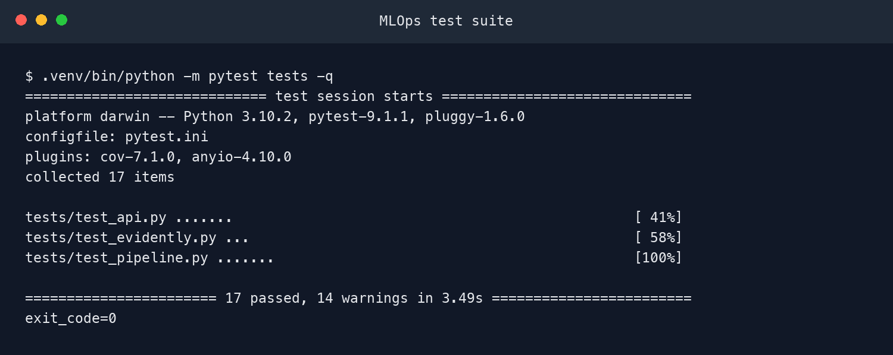
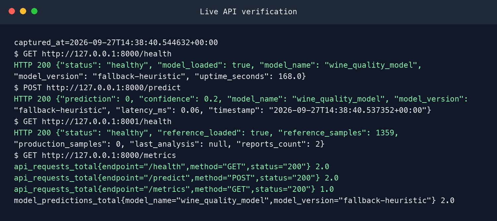

# Wine Quality MLOps Platform

An end-to-end machine learning platform for training, registering, serving, and
monitoring a binary wine-quality classifier.

**Maintainer:** CarolynLouise-dev

**Runtime:** Python 3.10

**Model task:** Predict whether a wine has good quality (`quality >= 6`)

## Overview

This project demonstrates the complete lifecycle of a production-oriented ML
system:

- deterministic data ingestion with SHA-256 versioning;
- schema, range, null, and duplicate validation;
- rejected-row quarantine and JSON quality reports;
- leakage-safe preprocessing with stratified splitting and standardization;
- ten tracked experiments across four model families;
- MLflow experiment tracking and model registration;
- scheduled orchestration with Apache Airflow;
- real-time prediction through FastAPI;
- statistical data-drift detection using the Kolmogorov-Smirnov test;
- Prometheus metrics and pre-provisioned Grafana dashboards;
- containerized infrastructure with Docker Compose;
- automated linting, tests, image builds, and smoke checks in CI.

## Architecture

```text
                          Airflow DAG
                ingest -> validate -> preprocess
                                  -> train -> promote
                                      |
                                      v
                  +----------------------------------+
                  | MLflow + PostgreSQL + MinIO     |
                  +----------------+-----------------+
                                   |
                                   v
                         FastAPI model service
                        /predict  /predict/batch
                           |              |
                           |              +----> Drift monitor
                           v
                     Prometheus metrics
                           |
                           v
                    Grafana dashboards
```

## Main Components

| Component | Location | Responsibility |
|---|---|---|
| Ingestion | `src/ingestion.py` | Normalize CSV input, calculate a SHA-256 digest, and save a snapshot |
| Validation | `src/validation.py` | Apply schema and domain checks, quarantine rejected records |
| Preprocessing | `src/preprocessing.py` | Build the binary target, split data, scale features, save artifacts |
| Evaluation | `src/evaluate.py` | Calculate classification metrics and render a confusion matrix |
| Training | `src/train.py` | Build estimators, track MLflow runs, register and promote models |
| Experiment runner | `scripts/run_experiments.py` | Execute and rank the ten-model experiment matrix |
| Inference API | `api/main.py` | Serve single and batch predictions with Prometheus instrumentation |
| Drift monitor | `evidently_service/main.py` | Capture traffic, compare distributions, archive HTML/JSON reports |
| Orchestration | `airflow/dags/wine_quality_dag.py` | Coordinate the daily end-to-end workflow |
| Simulation | `simulations/` | Generate normal and intentionally drifted production traffic |

## Repository Layout

```text
.
├── api/                       # FastAPI inference service
├── airflow/dags/              # Airflow workflow definition
├── config/
│   ├── grafana/               # Provisioned dashboards and data source
│   └── prometheus.yml         # Metrics scrape configuration
├── data/
│   ├── raw/                   # Source wine dataset
│   └── processed/             # Generated arrays, reports, and artifacts
├── evidently_service/         # Drift-monitoring service and reference data
├── evidences/                 # Runtime and UI verification images
├── mlflow/                    # MLflow container image
├── scripts/                   # Experiment, verification, and evidence tools
├── simulations/               # Normal and drift traffic scenarios
├── src/                       # Core machine learning pipeline
├── tests/                     # API, monitoring, and pipeline tests
├── docker-compose.yml
└── requirements.txt
```

## Data Pipeline

### 1. Ingestion

The ingestion stage accepts the original semicolon-delimited UCI format or a
standard comma-delimited CSV. It normalizes column names, records the row and
column count, calculates a SHA-256 digest, and optionally writes a normalized
snapshot.

### 2. Validation

Each wine feature is checked against an explicit physical range. Rows are also
rejected when they contain missing values, non-numeric measurements, or
duplicates. The validation gate fails when the rejected fraction exceeds the
configured threshold.

Generated validation artifacts:

- `clean_data.csv`
- `rejected_data.csv`
- `validation_report.json`

### 3. Preprocessing

The multiclass `quality` value is converted into a binary target:

```text
quality >= 6  -> 1 (good)
quality < 6   -> 0 (normal)
```

The pipeline uses a stratified 80/20 split. `StandardScaler` is fitted only on
the training partition to prevent data leakage.

### 4. Training and Evaluation

The experiment matrix contains ten configurations from:

- Logistic Regression
- Random Forest
- Gradient Boosting
- Support Vector Machine

Every run records hyperparameters, accuracy, F1, precision, recall, ROC-AUC,
the fitted model, and a confusion-matrix artifact. Results are ranked by F1.

## Local Setup

### Requirements

- Python 3.10+
- Docker with Docker Compose for the complete platform

### Create the environment

```bash
python3 -m venv .venv
source .venv/bin/activate
python -m pip install --upgrade pip
python -m pip install -r requirements.txt
```

Copy the example configuration when custom ports or credentials are needed:

```bash
cp .env.example .env
```

## Run the Tests

```bash
pytest tests -v
```

The current implementation passes all 17 API, drift-monitoring, ingestion,
validation, preprocessing, training-factory, and evaluation tests.

CI-equivalent syntax and import validation:

```bash
flake8 src api evidently_service simulations scripts tests \
  --count --select=E9,F63,F7,F82 --show-source --statistics
```

## Run the Experiment Matrix

```bash
python scripts/run_experiments.py
```

When `http://localhost:5050` is unavailable, the runner automatically stores
MLflow runs under the local `mlruns/` directory. The ranked result table is
written to:

```text
data/processed/experiment_results.csv
```

## Run Services Locally

Inference API:

```bash
uvicorn api.main:app --host 127.0.0.1 --port 8000
```

Drift monitor:

```bash
uvicorn evidently_service.main:app --host 127.0.0.1 --port 8001
```

Useful URLs:

| Service | URL |
|---|---|
| API documentation | `http://localhost:8000/docs` |
| API health | `http://localhost:8000/health` |
| API metrics | `http://localhost:8000/metrics` |
| Drift documentation | `http://localhost:8001/docs` |
| Drift health | `http://localhost:8001/health` |
| Drift reports | `http://localhost:8001/reports` |

If the MLflow registry is unavailable or does not yet contain a promoted
model, the API loads a deterministic fallback model so health checks and smoke
tests remain operational.

## Prediction Examples

Single prediction:

```bash
curl -X POST http://localhost:8000/predict \
  -H "Content-Type: application/json" \
  -d '{
    "features": [7.4, 0.70, 0.00, 1.9, 0.076, 11.0, 34.0, 0.9978, 3.51, 0.56, 9.4]
  }'
```

Batch prediction:

```bash
curl -X POST http://localhost:8000/predict/batch \
  -H "Content-Type: application/json" \
  -d '{
    "samples": [
      [7.4, 0.70, 0.00, 1.9, 0.076, 11.0, 34.0, 0.9978, 3.51, 0.56, 9.4],
      [10.2, 0.35, 0.40, 2.2, 0.065, 15.0, 45.0, 0.9960, 3.20, 0.75, 11.5]
    ]
  }'
```

## Full Docker Stack

Validate the Compose configuration:

```bash
docker compose config -q
```

Start all services:

```bash
docker compose up -d --build
docker compose ps
```

| Service | Port | Purpose |
|---|---:|---|
| Grafana | 3000 | Dashboards |
| PostgreSQL | 5432 | MLflow and Airflow metadata |
| MLflow | 5050 | Experiment tracking and model registry |
| FastAPI | 8000 | Online inference |
| Drift monitor | 8001 | Distribution monitoring and reports |
| Airflow | 8080 | Workflow orchestration |
| MinIO API | 9000 | Artifact object storage |
| MinIO Console | 9001 | Artifact-storage UI |
| Prometheus | 9090 | Metrics collection |

Stop the platform:

```bash
docker compose down
```

## Drift Simulation

With the API and drift monitor running:

```bash
python simulations/run_simulation.py
```

The simulation first sends baseline traffic and then shifts alcohol, volatile
acidity, sulphates, chlorides, and total sulfur dioxide. The monitor compares
the current window with the reference dataset using two-sample KS tests and
updates these metrics:

- `evidently_data_drift_detected`
- `evidently_drift_score`
- `evidently_feature_drift`
- `evidently_drifted_features_count`
- `evidently_missing_values_ratio`

## Operational Metrics

The inference service exposes:

- `api_requests_total`
- `api_request_latency_seconds`
- `model_predictions_total`
- `model_prediction_latency_seconds`
- `model_prediction_value`
- `model_feature_value`
- `model_prediction_errors_total`
- `model_version_info`

Prometheus scrapes the API and drift service. Grafana dashboards are loaded
automatically from `config/grafana/dashboards/`.

## Workflow Orchestration

The `wine_quality_mlops_pipeline` DAG runs these stages:

```text
ingest -> validate -> preprocess -> train -> quality gate -> promote
              |                                      |
              +--------------------------------------+
                              |
                              v
                    synchronize drift baseline
```

The model promotion gate requires F1 of at least `0.70`. Pipeline tasks use
retries, exponential backoff, isolated staging paths, and failure callbacks.

## CI/CD

The GitHub Actions workflow performs three stages:

1. install dependencies, lint, test, and execute the experiment matrix;
2. build the API and drift-monitor images;
3. run a container smoke test against health, prediction, and metrics endpoints.

## Verification Evidence

### Automated tests



### Live API verification



The machine-readable runtime capture is available at
`evidences/runtime_verification.json`.

Additional screenshots under `evidences/` document MLflow, model registry,
Prometheus, Grafana, MinIO, API documentation, drift reports, and evaluation
artifacts.

## Configuration Notes

The values in `.env.example` are development defaults only. Replace all
database, object-storage, and dashboard credentials before deploying outside a
local environment. Do not commit a populated `.env` file.

## Maintainer

CarolynLouise-dev

`hoa25ms23263@fsb.edu.vn`
